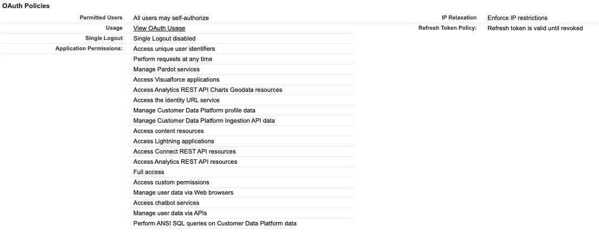
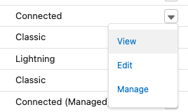
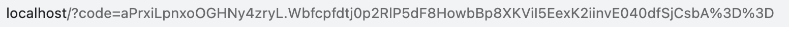
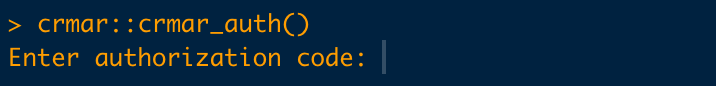

```{r setup, include=FALSE}
knitr::opts_chunk$set(echo = TRUE)
```

## Install the package 'crmar'
```{r}
#using devtools
devtools::install_github('https://github.com/searchdiscovery/crmar.git')
```

## Authorization

### Creating OAuth Credentials

The package uses OAuth to authorize end users to pull interact with the Salesforce CRM Analytics API.

1. Create your connected app and complete its basic information.
2. Configure the necessary OAuth settings for the connected app.
3. Enable the client credentials flow for your connected app.
    a. From Setup, in the Quick Find box, enter Apps, and then select App Manager.
    b. Find your connected app, click Action dropdown, and then select Edit.
    c. Under API (Enable OAuth Settings), select Enable Client Credentials Flow.
    d. When you understand the security risks, accept the warning.
    e. Save your changes.
4. Select an execution user for the flow.
    **Although there’s no user interaction in the client credentials flow, Salesforce still requires you to specify an execution user. By selecting an execution user, you allow Salesforce to return access tokens on behalf of this user.**
    ***NOTE* Permitted Users policies, such as All users may self-authorize and Admin approved users are pre-authorized, don’t apply to the execution user.**
    a. From the connected app detail page, click Manage.
    b. Click Edit Policies.
    c. Under Client Credentials Flow, for Run As, click Magnifying glass icon, and find the user that you want to assign the client credentials flow.
The execution user must have the API Only permission.
    d. Save your changes.
    
#### Sample Oauth Policies

### Storing Secrets

Once the connected app has been created you will need to get the 'consumer key' and 'consumer secret' from the connected app.  
1. Go to Apps > App Manager 
2. Find the app and click on the drop down in the last column and select "view"

3. Click on the "Manage Consumer Details" button
4. Verify by entering a validation code sent to your email
5. Copy and paste the consumer key and consumer secret into the .Renviron file

```
CONSUMER_KEY = "[insert consumer key]"
CONSUMER_SECRET = "[insert consumer secret]"
```

**Hint** - To create or edit the .Renviron file you can use the 'usethis' package.
```
usethis::edit_r_environ('user')
```
This will create or bring up the .Renviron file at the user level.  Edit the changes and save the file. Once saved it is important that you **restart your R session**. Restarting the session will allow the new variables to be referenced in the global environment.
                       
## Package OAuth Dance

```{r}
library(crmar)
library(tidyverse)

#authorize
crmar::crmar_auth()
```

This is where things get a bit tricky.  The initial authorization results in a plain white browser window with the token in the URL parameter.



Copy everything after "?code=" and paste it into the the console.


Before pressing "enter", change out the "%3D%3D" to "==" then press enter. 

The result will be "Successfully autenticated with OAuth" message in the console and a new token file ".httr-oauth" in the working directory.

#### Important: Re-Authentication Process

This token will last for 24 hours. After that you will receive the same confirmation message when you run the crmar::crmar_auth() function but none of the functions will pull data.  The solution is to manually delete the ".httr-oauth" file and then run the authentication function.  This will refresh the token and enable you to pull data again.

## Pulling Data

Once the authorization is complete the following code sample can be used to pull CSV files that were created in CRMA recipes where the output nodes were assigned to you.

```{r}
#Get the Dataset Export Ids
dse <- get_datasetexports(limit = 100)

#Filter down to the recent Output Node Name 
## Important: each node can be uniquely named in the recipe.
## If you have more than one CSV file make sure to name the nodes unique so you can more easily identify them.
ids <- dse %>%
  filter(as.Date(CreatedDate) == Sys.Date()) %>%
  separate(PublisherInfo, into = c('fileid', 'node'), sep = ':') %>%
  group_by(node) %>%
  filter(CreatedDate == max(CreatedDate)) %>%
  arrange(node) %>%
  group_by(node) %>%
  mutate(time_clean = lubridate::ymd_hms(CreatedDate)) %>%
  select(node, Id, time_clean) %>%
  filter(time_clean == max(time_clean)) %>%
  pull(Id, node)

#Get all the parts for the dataset export file
dsep <- get_datasetexportparts(ids['OUTPUT2'])


#Pull the raw data by from each dataset export part (dsep) and compile the csv parts in a dataframe.
df <- get_datasetexportpartfile(dsep$Id, dsep$DataFileLength, exportpartid = dsep$DatasetExportId)

